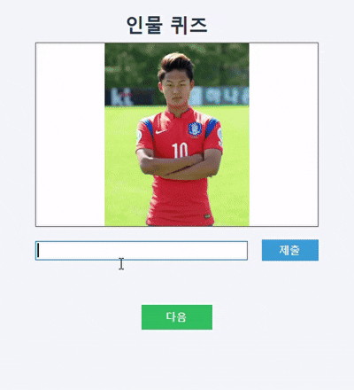
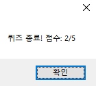

# 👤 PersonQuiz

사진을 보고 인물의 이름을 맞히는 Windows Forms 기반 퀴즈 프로그램입니다.  
간단한 UI와 직관적인 사용법으로 누구나 쉽게 인물 퀴즈를 즐길 수 있습니다.

---

## 🖼️ 미리보기

---

## ✨ 주요 기능

- 🎲 **랜덤 인물 퀴즈**: 등록된 인물 사진이 무작위로 출제됩니다.
- 📝 **정답 입력 및 즉시 채점**: 이름을 입력하면 바로 정답 여부를 확인할 수 있습니다.
- 🏅 **점수 집계**: 퀴즈가 끝나면 최종 점수를 안내합니다.
- 🎨 **간결하고 깔끔한 UI**: 직관적인 폼 디자인과 컬러 테마 적용.
- 📦 **리소스 기반 이미지 관리**: 프로젝트 내 리소스에 이미지를 등록하여 관리가 편리합니다.

---

## 🛠️ 기술 스택

- **언어**: C# 7.3
- **플랫폼**: .NET Framework 4.7.2
- **UI**: Windows Forms (WinForms)
- **리소스 관리**: Resources.resx (내장 이미지 리소스)

---

## 💾 설치 및 실행 방법
- [💾다운로드](https://github.com/hiro2329/PersonQuiz/raw/refs/heads/main/PersonQuiz/bin/Debug.zip)  (압축 해제 후 PersonQuiz.exe 파일 실행)

  또는
 
1. 📥 **프로젝트 다운로드**
   - 이 저장소를 클론하거나 ZIP 파일로 다운로드 후 압축을 풉니다.

2. 🖥️ **Visual Studio에서 열기**
   - Visual Studio 2017 이상에서 `PersonQuiz.sln` 솔루션 파일을 엽니다.

3. ▶️ **빌드 및 실행**
   - `F5` 또는 `디버그 > 디버깅 시작`을 클릭하여 프로그램을 실행합니다.
 
--- 
🖼️ **리소스(이미지) 추가**
   - `Properties/Resources.resx` 파일을 더블 클릭하여 엽니다.
   - `[추가] → [기존 파일 추가]`로 인물 사진을 등록합니다.
   - 리소스 이름은 코드에서 사용할 이름(예: `이정현`, `류현진`)과 정확히 일치해야 합니다.
---

## 📝 사용법

1. 프로그램을 실행하면 인물 사진이 무작위로 표시됩니다.
2. 사진 아래 입력란에 인물의 이름을 입력하고 **제출** 버튼을 누릅니다.
3. 정답 여부가 바로 표시됩니다.
4. **다음** 버튼을 눌러 다음 문제로 넘어갑니다.
5. 모든 문제를 풀면 최종 점수가 안내됩니다.

---

## 📸 캡처 화면

> 아래는 실제 프로그램 실행 화면 예시입니다.  

---

## 🙏 참고 및 주의사항

- 리소스 이름과 코드의 이름이 다르면 이미지가 정상적으로 표시되지 않습니다.
- .NET Framework 4.7.2 이상이 설치된 Windows 환경에서만 실행됩니다.

---
## 이미지 표시 오류 해결 방법

이미지가 정상적으로 표시되지 않는 경우, 아래 순서대로 진행해 주세요.

1. **솔루션 다시 빌드**  
   Visual Studio에서 __솔루션 다시 빌드__를 실행합니다.  
   메뉴: __빌드 > 솔루션 다시 빌드__

2. **솔루션 빌드**  
   문제가 계속된다면 __솔루션 빌드__를 실행합니다.  
   메뉴: __빌드 > 솔루션 빌드__

이 과정을 통해 리소스(이미지) 관련 오류가 해결될 수 있습니다.
